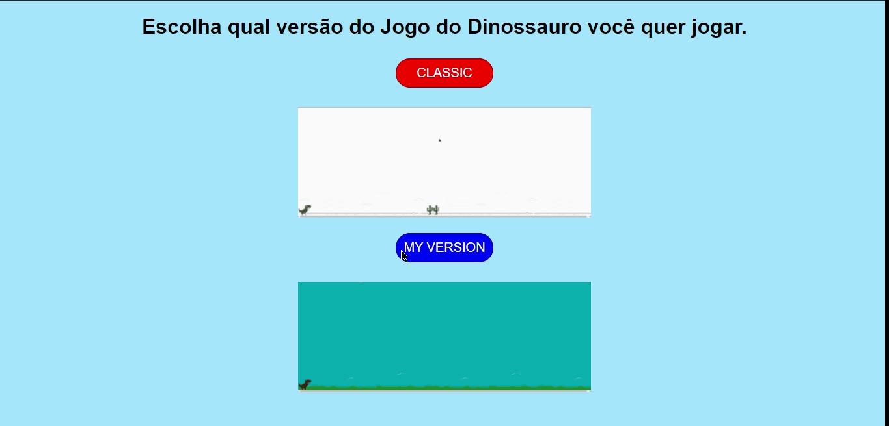

---

<div style="text-align: justify">

### Descrição
Um clone do famoso Jogo do Dinossauro que aparece no Google Chrome quando não há conexão com a internet, esse é um projeto bem simples desenvolvido em JavaScript e existem 2 versões, a clássica e outra com algumas modificações minhas. Esse projeto foi desenvolvido durante o bootcamp JavaScript Game Developer da plataforma Digital Innovation One.

</div>

---

#### Link da Plataforma:

* [Digital Innovation One](https://digitalinnovation.one/)

---

Esse projeto foi desenvolvido com as seguintes tecnologias:
* HTML5
* CSS3
* JavaScript

---

Para ver o projeto você pode clonar ele com o seguinte comando:    

```sh
git clone https://github.com/ale-mouraboni/dino-game.git
```  
  
Você também pode baixar o arquivo .zip do projeto, basta clicar no botão abaixo.  
  
[Baixar Projeto](https://github.com/ale-mouraboni/dino-game/archive/refs/heads/main.zip)

---

### License
This project is under the MIT license. See the [LICENSE] for more information.

---