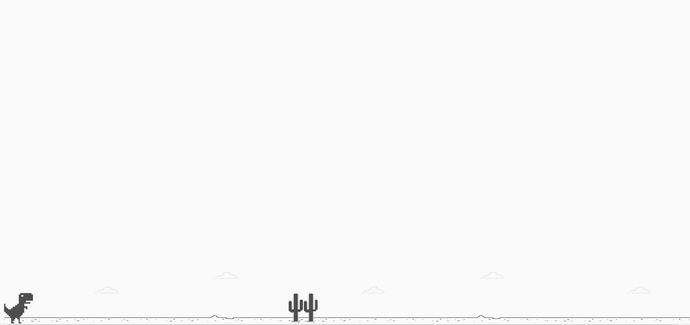
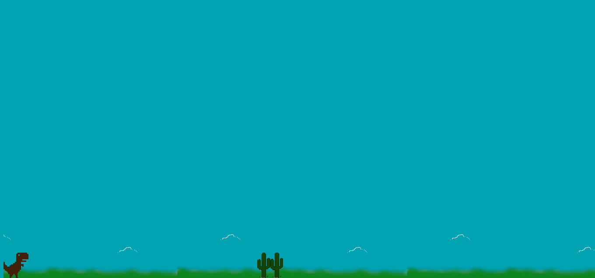

# Demo




## Menu
* [Tecnologias](#Tecnologias)
* [Como Utilizar](#Como-Utilizar)
* [About](#About)
* [Link do Curso](#Link-do-Curso)
* [License](#License)

## Tecnologias
Projeto desenvolvido com as seguintes tecnologias:
* HTML5
* CSS3
* JavaScript

## Como Utilizar
```
1. - Clone o repositório
$ git clone https://github.com/ale-mouraboni/dino-game.git

2. - Abra o index.html
```

## About
Um clone do famoso jogo do dinossauro que aparece no google chrome quando não há conexão de internet.  
Neste projeto há duas versões, a clássica e uma versão com algumas modificações minhas.  
Esse projeto foi desenvolvido durante o bootcamp **JavaScript Game Developer** na plataforma **Digital Innovation One**.

### Link do Curso:

* [Digital Innovation One - JavaScript Game Developer](https://digitalinnovation.one/)

## License
This project is under the MIT license. See the [LICENSE] for more information.

