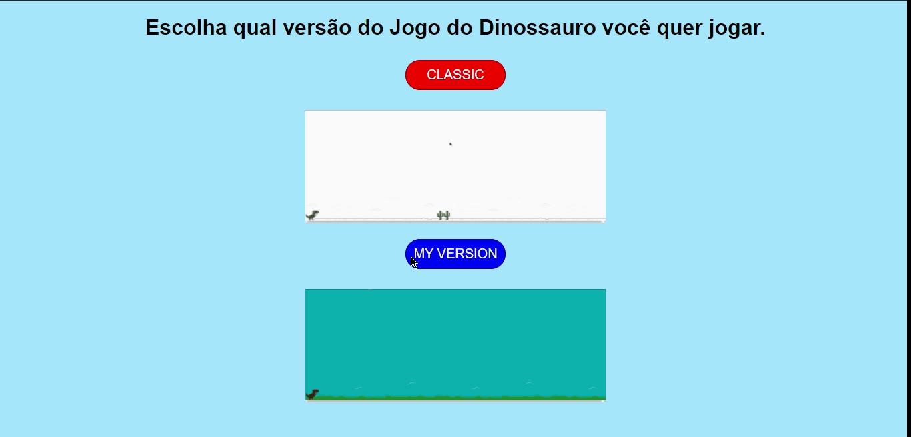

<h1 align="center">Dino Game</h1>
<p align="center">A clone of the famous Google Chrome Dinosaur Game. Project made in the JavaScript Game Developer bootcamp on the <strong>Digital Innovation One</strong> platform.
</br>
<a href="https://www.digitalinnovation.one">Access Platform</a>
</p>

<p align="center">
  

  

  

  
</p>

<p align="center">
  <a href="#rocket-about">About</a>
  &nbsp;&nbsp;&nbsp;|&nbsp;&nbsp;&nbsp;
  <a href="#memo-license">License</a>
</p>



---

### :rocket: About
Project information

:heavy_check_mark: Project developed with the following technologies:
* HTML5
* CSS3
* JavaScript

:heavy_check_mark: Clone the project with the command:

```sh
git clone https://github.com/ale-mouraboni/dino-game.git
```  
  
:heavy_check_mark: Or download the .zip file:  
  
* [Download Project](https://github.com/ale-mouraboni/dino-game/archive/refs/heads/main.zip)

---

### :memo: License
This project is under the MIT license. See the [LICENSE] for more information.

---
